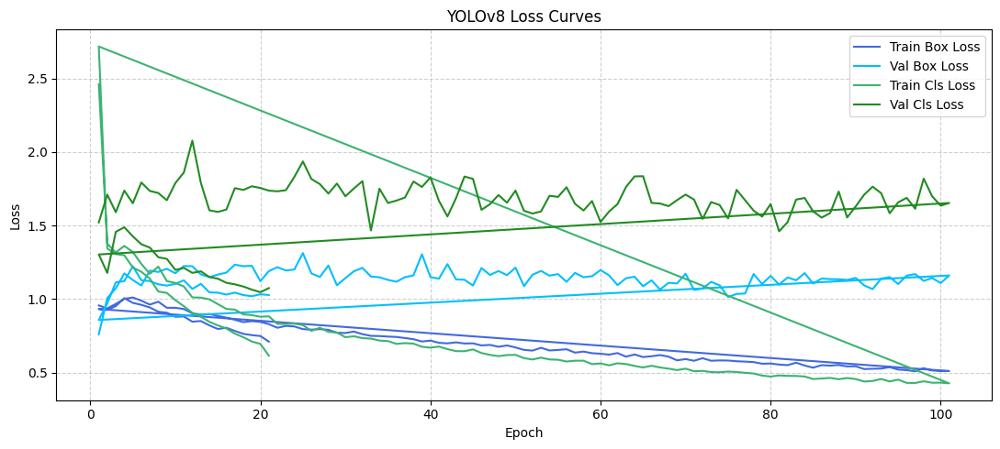

<h1 align="center"><strong>YOLOv8 Object Detection: Training, Evaluation & Demo App</strong></h1>

---

<h2 align="center"><strong>1. Model and Dataset</strong></h2>

This project uses the <strong>YOLOv8</strong> architecture for object detection, trained on the <strong>PASCAL VOC 2012</strong> dataset.

- <strong>Model file:</strong> [best.pt](https://github.com/MariHovhannisyan/CNN/blob/master/Lab3/best.pt)
- <strong>Dataset:</strong> PASCAL VOC 2012  
  - 20 object categories  
  - Used for detection, localization, and classification

---

<h2 align="center"><strong>2. Training Results: Loss & Accuracy Curves</strong></h2>

<p align="center">
  <br>
  <em>YOLOv8 Loss Curves (Box & Class, Train/Val)</em>
</p>

<p align="center">
  <br>
  <em>YOLOv8 Accuracy & Metric Curves (Precision, Recall, mAP@0.5, mAP@0.5:0.95)</em>
</p>

- **Loss Curves:** Track box/class loss for train and val sets to show convergence and spot overfitting/underfitting.
- **Accuracy Curves:** 
  - <strong>Precision</strong>, <strong>Recall</strong>
  - <strong>mAP@0.5</strong> (best: <b>0.760</b> at epoch 17)
  - <strong>mAP@0.5:0.95</strong> (best: <b>0.497</b> at epoch 83)

---

<h2 align="center"><strong>Experimenting with Hyperparameters</strong></h2>

To achieve higher accuracy and address **overfitting**, we experimented with various hyperparameters (learning rate, batch size, optimizer, data augmentation, etc.).  
Below are the loss and accuracy curves **before** and **after** the hyperparameter improvements:

<p align="center">
  <b>Before Hyperparameter Tuning:</b><br>
  <br>
  <br>
  <br>
  <em>Before tuning, the model suffered from high validation loss and unstable metrics, indicating possible overfitting and poor generalization.</em>
</p>

<p align="center">
  <b>After Hyperparameter Tuning:</b><br>
  <br>
  <em>After improvements, loss curves became smoother and validation metrics improved, showing better generalization and less overfitting.</em>
</p>

- <strong>Key changes:</strong>
  - Adjusted learning rate and batch size
  - Switched optimizer (e.g., SGD)
  - Added strong data augmentation (mosaic, mixup, flip, etc.)
  - Increased patience and training epochs

---

<h2 align="center"><strong>3. Benchmark Comparison</strong></h2>

<p align="center">
  <br>
  <em>YOLOv8 Results vs. Community Benchmark (PASCAL VOC 2012)</em>
</p>

- <strong>mAP@0.5:</strong> <b>0.760</b> (within typical YOLOv8s range: 0.70–0.80)
- <strong>mAP@0.5:0.95:</strong> <b>0.497</b> (within typical YOLOv8s range: 0.50–0.57)

---

<h2 align="center"><strong>4. Running the Demo App (<code>app.py</code>)</strong></h2>

This repo provides an interactive demo for object detection using Streamlit.  
<strong>You can choose between two input sources:</strong>
- <strong>Webcam</strong>: Run detection live on your camera.
- <strong>Video File</strong>: Upload and process a video (e.g., mp4).

<strong>App features:</strong>
- Select YOLOv8 model (.pt) path
- Choose webcam or video file as input
- Displays annotated detection results in real time

<strong>To run the app locally:</strong>

```bash
# Install dependencies
pip install streamlit ultralytics opencv-python

# Run the Streamlit app
streamlit run app.py